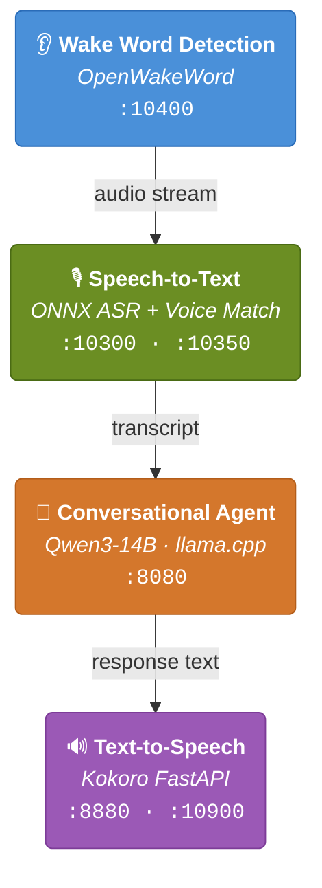

#  Home Assistant Voice Control Recipes


GPU/CUDA-accelerated voice control stack for Home Assistant. Runs on **x86/x64** and **GB10 ARM64** devices (including the [NVIDIA DGX Spark](https://www.nvidia.com/en-us/products/workstations/dgx-spark/)).

## 100% Local - No Cloud, No Subscriptions, No Data Leaving Your Network

Every component in this stack runs **entirely on your own hardware**. Your voice commands, transcriptions, conversations, and responses never leave your local network - no cloud APIs, no third-party services, no internet connection required after initial setup.

## Architecture Overview



Every component runs as a Docker container with NVIDIA GPU passthrough, communicating via the [Wyoming protocol](https://github.com/rhasspy/wyoming) - Home Assistant's native voice satellite interface.

---

## 1. 👂 Wake Word Detection - [OpenWakeWord](https://github.com/rhasspy/wyoming-openwakeword)

**Directory:** [`wake-word/openwakeword/`](wake-word/openwakeword/)

Listens for a wake word to activate the voice pipeline. Uses the `okay_nabu` model by default, with support for custom wake word models.

| Setting | Value |
|---------|-------|
| Image | `rhasspy/wyoming-openwakeword:latest` |
| Port | `10400` (TCP + UDP) |
| Wake Word | `okay_nabu` |
| Threshold | `0.65` |
| Trigger Level | `3` |

**Custom models** can be placed in `/opt/models/wyoming-openwakeword/custom` and will be available in the `/custom` directory inside the container.

```bash
cd wake-word/openwakeword
docker compose up -d
```

---

## 2. 🎙️ Speech-to-Text (STT) - [Wyoming ONNX ASR](https://github.com/jxlarrea/wyoming-onnx-asr)

**Directory:** [`speech-to-text/wyoming-onnx-asr/`](speech-to-text/wyoming-onnx-asr/)

Converts speech audio into text using GPU-accelerated ONNX models. Based on [wyoming-onnx-asr](https://github.com/tboby/wyoming-onnx-asr) by tboby (x86 only). The [fork used here](https://github.com/jxlarrea/wyoming-onnx-asr) adds GB10 ARM64 support, enabling it to run on the NVIDIA DGX Spark and other systems. The recommended model is **NVIDIA NeMo Parakeet TDT 0.6B v2** - a fast, accurate ASR model optimized for streaming speech recognition.

| Setting | Value |
|---------|-------|
| Image | `ghcr.io/jxlarrea/wyoming-onnx-asr-gpu` |
| Port | `10300` |
| Model | `nemo-parakeet-tdt-0.6b-v2` |

Alternative models (commented out in the compose file):
- `onnx-community/whisper-large-v3-turbo`
- `mekpro/whisper-medium-turbo`

```bash
cd speech-to-text/wyoming-onnx-asr
docker compose up -d
```

### Voice Extraction & Speaker Verification - [Wyoming Voice Match](https://github.com/jxlarrea/wyoming-voice-match)

**Directory:** [`speech-to-text/wyioming-voice-match/`](speech-to-text/wyioming-voice-match/)

A Wyoming protocol ASR proxy that **extracts your voice from background noise** before forwarding audio to the downstream STT service. This solves two common problems: false activations triggered by TVs or radios, and noisy transcripts contaminated with background audio.

How it works:

1. **Audio buffering** - Captures incoming audio after wake word detection
2. **Speaker verification** - Analyzes the loudest segment against enrolled voiceprints using [ECAPA-TDNN](https://arxiv.org/abs/2005.07143) neural speaker embeddings. If no match is found, the pipeline stops silently - preventing false activations
3. **Speaker extraction** - Divides the full audio into speech regions, keeping only regions that match your voiceprint. Background voices (TV, radio, other people) are discarded
4. **ASR forwarding** - Sends the cleaned audio - containing only your voice - to the downstream STT service for transcription

The result is dramatically cleaner transcriptions, especially in noisy environments.

| Setting | Value |
|---------|-------|
| Image | `ghcr.io/jxlarrea/wyoming-voice-match:latest` |
| Port | `10350` |
| Upstream | `tcp://<ASR_HOST>:10300` |
| Verify Threshold | `0.26` |
| Extraction Threshold | `0.25` |
| Require Speaker Match | `true` |

Voice Match sits in front of the ONNX ASR service as a proxy. Update `UPSTREAM_URI` to point to your ASR instance. When `REQUIRE_SPEAKER_MATCH=true`, only enrolled speakers can trigger commands. Speaker verification runs in 5-25ms on GPU.

```bash
cd speech-to-text/wyioming-voice-match
docker compose up -d
```

---

## 3. 🧠 Conversational Agent (LLM) - [Qwen3-14B](https://huggingface.co/unsloth/Qwen3-14B-GGUF)

**Directory:** [`conversational-agent-llm/`](conversational-agent-llm/)

The brain of the pipeline. Runs [Qwen3-14B](https://huggingface.co/unsloth/Qwen3-14B-GGUF) (Q8_0 quantization) with **speculative decoding** using a [Qwen3-0.6B](https://huggingface.co/unsloth/Qwen3-0.6B-GGUF) (Q4_K_M quantization) draft model for significantly faster inference. Served via [llama.cpp](https://github.com/ggml-org/llama.cpp) with an OpenAI-compatible API. If you don't have the VRAM to run the 14B model, [Qwen3.5-9B](https://huggingface.co/unsloth/Qwen3.5-9B-GGUF) (Q8_0 quantization) is a solid alternative for GPUs with less memory.

A sample system prompt is included in [`system-prompt.txt`](conversational-agent-llm/system-prompt.txt). It configures the LLM as a concise voice assistant that maps natural language commands to Home Assistant scripts and tool calls. The prompt defines script mappings for common phrases (e.g. "make it cozy" triggers `script.ai_master_bedroom_cozy`), enforces tool argument rules, and keeps responses short and plain text for TTS output. Use it as a starting point and customize it with your own scripts and devices.

### How It Works

The LLM component uses a two-layer architecture: a **base image** and **model-specific compose stacks**.

#### Step 1: Build the Base Image

The [`llama-base-image/`](conversational-agent-llm/llama-base-image/) directory contains Dockerfiles that compile [llama.cpp](https://github.com/ggml-org/llama.cpp) from source and bundle it with **llama-proxy** (a Go-based logging proxy) into a single Docker image tagged `llama-server:latest`.

Use [`build.sh`](conversational-agent-llm/llama-base-image/build.sh) to build the base image:

```bash
cd conversational-agent-llm/llama-base-image

# x86_64 (default)
./build.sh

# ARM64 / DGX Spark
./build.sh arm64
```

The x86 build uses [`Dockerfile`](conversational-agent-llm/llama-base-image/Dockerfile) which auto-detects CUDA architectures. The ARM64 build uses [`Dockerfile.arm64`](conversational-agent-llm/llama-base-image/Dockerfile.arm64) which targets CUDA architecture 121 (Blackwell/GB10) specifically.

You only need to rebuild this image when llama.cpp itself gets updated.

#### Step 2: Launch a Model

Each model has its own compose stack that uses the `llama-server:latest` base image. Pick the model that fits your VRAM:

- [`llama-qwen3-14b-q8/`](conversational-agent-llm/llama-qwen3-14b-q8/) — Qwen3-14B with speculative decoding (recommended)
- [`llama-qwen3.5-9b-q8/`](conversational-agent-llm/llama-qwen3.5-9b-q8/) — Qwen3.5-9B lightweight alternative

```bash
cd conversational-agent-llm/llama-qwen3-14b-q8
docker compose up -d
```

Place your GGUF model files in `/opt/models/llama-server/`. The compose files mount this directory as read-only at `/models` inside the container.

### Llama-Proxy (Request Analytics)

The Qwen3-14B compose stack includes **llama-proxy**, a transparent proxy that sits between Home Assistant and llama-server. It uses the same `llama-server:latest` base image but runs the `llama-proxy` binary instead.

```
Home Assistant (:8080) → llama-proxy → llama-server (:8081)
```

When configuring the LLM in Home Assistant, point it to the **proxy port** (`http://<host>:8080/v1`), not directly to llama-server. The proxy forwards all requests transparently while capturing metrics:

- Request/response latency
- Token counts and tokens per second
- Speculative decoding draft acceptance rates
- KV cache hit rates
- Tool calls and their arguments
- Full conversation history per request

All metrics are viewable in a built-in **web dashboard** at `http://<host>:9090`.

| Port | Service |
|------|---------|
| `8080` | llama-proxy (Home Assistant connects here) |
| `8081` | llama-server (direct access if needed) |
| `9090` | Dashboard (request analytics) |

### Key Configuration

| Parameter | Value | Purpose |
|-----------|-------|---------|
| Main Model | `Qwen3-14B-Q8_0.gguf` | Primary inference model |
| Draft Model | `Qwen3-0.6B-Q4_K_M.gguf` | Speculative decoding for faster generation |
| Context Window | `18192` tokens | Sufficient for complex multi-turn conversations |
| GPU Layers | `999` | Offload all layers to GPU |
| Temperature | `0.0` | Deterministic output for reliable smart home control |
| Flash Attention | `on` | Faster attention computation |
| KV Cache Quantization | `Q8_0` | Reduced VRAM usage |
| Thinking Mode | `disabled` | Skips chain-of-thought for lower latency |

### Speculative Decoding

The draft model (`Qwen3-0.6B-Q4_K_M`) proposes candidate tokens that the main model (`Qwen3-14B-Q8_0`) verifies in parallel. This yields significant speedups for tool-calling workloads where output patterns are predictable.

| Draft Parameter | Value |
|----------------|-------|
| `--draft-max` | `16` |
| `--draft-min` | `1` |
| `--draft-p-min` | `0.75` |

<details>
<summary><strong>Benchmarks (NVIDIA GB10 - DGX Spark)</strong></summary>

Tested across 20 different home automation commands with 3 repetitions each. Full results in [`qwen3-benchmarks.md`](conversational-agent-llm/qwen3-benchmarks.md).

| Metric | Result |
|--------|--------|
| Accuracy | **100%** (60/60 correct) |
| Average Latency | **437 ms** |
| Min Latency | 293 ms |
| Max Latency | 918 ms |

Sample commands from the benchmark:

| Voice Command | Avg (ms) | Accuracy | Tool Called |
|---------------|----------|----------|-------------|
| "it is bedtime" | 418 | 3/3 | `script.ai_master_bedroom_bedtime` |
| "make it cozy" | 427 | 3/3 | `script.ai_master_bedroom_cozy` |
| "food is here" | 453 | 3/3 | `script.food_delivery_here` |
| "open bedroom shades" | 469 | 3/3 | `script.ai_open_master_bedroom_curtains` |
| "turn on office ac" | 458 | 3/3 | `script.office_ac_on_eco` |
| "dim the office" | 462 | 3/3 | `scene_office_dim` |
| "we have visitors" | 437 | 3/3 | `ai_we_have_visitors` |
| "close office shades" | 504 | 3/3 | `script.ai_close_office_curtains` |

</details>

---

## 4. 🔊 Text-to-Speech (TTS) - Kokoro FastAPI

**Directory:** [`text-to-speech/kokoro/`](text-to-speech/kokoro/)

Converts LLM responses back to natural-sounding speech using [Kokoro FastAPI](https://github.com/remsky/Kokoro-FastAPI), a GPU-accelerated ONNX TTS engine. A [Wyoming-OpenAI bridge](https://github.com/roryeckel/wyoming_openai) translates between the Wyoming protocol and Kokoro's OpenAI-compatible API.

This stack consists of two services:

### Kokoro FastAPI (TTS Engine)

| Setting | Value |
|---------|-------|
| Port | `8880` |
| ONNX GPU | `True` |
| ONNX Threads | `12` |
| Inter-Op Threads | `6` |
| Execution Mode | `parallel` |
| Optimization Level | `all` |

### Wyoming-OpenAI Bridge

| Setting | Value |
|---------|-------|
| Image | `ghcr.io/roryeckel/wyoming_openai:latest` |
| Port | `10900` (exposed) → `10300` (internal) |
| Voice | `af_sky` |
| Speed | `1.1x` |
| Streaming | Enabled (min 6 words, max 220 chars) |

The bridge exposes a Wyoming-compatible endpoint on port `10900` that Home Assistant can discover and use as a TTS provider.

### x86/x64

On x86/x64 systems, use the default [`compose.yaml`](text-to-speech/kokoro/compose.yaml) which pulls the upstream image directly:

```bash
cd text-to-speech/kokoro
docker compose up -d
```

### ARM64 (DGX Spark)

On ARM64 machines like the DGX Spark, the upstream Kokoro GPU Dockerfile is **broken** - it uses `FROM --platform=$BUILDPLATFORM` which forces an x86 base image, causing the build to fail. You need to build the image locally first, then use the ARM64-specific compose file.

The included [`kokorofastapi-arm64-build-patch.sh`](text-to-speech/kokoro/kokorofastapi-arm64-build-patch.sh) script handles the build:

```bash
cd text-to-speech/kokoro
bash kokorofastapi-arm64-build-patch.sh
```

What the script does:

1. **Clones** the [Kokoro FastAPI repo](https://github.com/remsky/Kokoro-FastAPI) into `./Kokoro-FastAPI` (skipped if already cloned)
2. **Pulls the latest changes** from upstream
3. **Patches the Dockerfile** - uses `sed` to strip the `--platform=$BUILDPLATFORM` flag, writing a corrected `Dockerfile.arm64` that builds natively on the host architecture
4. **Builds a local Docker image** tagged as `kokoro-fastapi-gpu:local`
5. **Restarts the compose stack** using [`compose.arm64.yaml`](text-to-speech/kokoro/compose.arm64.yaml)

Re-run this script whenever you want to update Kokoro FastAPI to a newer version. To start the ARM64 stack manually:

```bash
cd text-to-speech/kokoro
docker compose -f compose.arm64.yaml up -d
```

### Volume Configuration

The [`kokoro.env`](text-to-speech/kokoro/kokoro.env) file is mounted into the container and controls runtime settings like `default_volume_multiplier=3.0`. Place your model files in `/opt/models/kokoro`.

---

## 5. 📱 Voice Satellite

A [Home Assistant custom card and integration](https://github.com/jxlarrea/voice-satellite-card-integration) that turns **any web browser into a voice satellite** - wall-mounted tablets, kiosks, or any device running the HA dashboard becomes a fully functional voice control endpoint with no dedicated hardware required.

Key features:

- **In-browser wake word detection** - Runs microWakeWord locally via TensorFlow Lite WebAssembly, so wake word processing happens on the device itself without hitting the server
- **Continuous listening** - Automatically returns to wake word mode after each conversation, behaving like a dedicated satellite
- **Visual feedback** - Themed activity bar showing pipeline state (listening, processing, speaking), real-time transcription display, and reactive audio visualizations. Includes built-in skins (Alexa, Google Home, Siri, Retro Terminal, and more)
- **Voice-controlled timers** - On-screen countdown pills with alerts
- **Announcements** - Receive TTS announcements via service calls with pre-announcement chimes
- **Multi-turn conversations** - Continue talking without repeating the wake word
- **Audio processing** - Built-in noise suppression, echo cancellation, auto-gain, and voice isolation
- **Per-device configuration** - Each browser/tablet can have its own satellite entity and settings on a shared dashboard

This is the presentation layer that ties the entire pipeline together - it captures the user's voice via the browser microphone and feeds it through the Wake Word → STT → LLM → TTS stack described above, then plays back the synthesized response.

---

## Port Reference

| Service | Port | Protocol |
|---------|------|----------|
| Wake Word (OpenWakeWord) | `10400` | TCP/UDP |
| Speech-to-Text (ONNX ASR) | `10300` | TCP |
| Speaker Verification (Voice Match) | `10350` | TCP |
| LLM Proxy (Home Assistant connects here) | `8080` | HTTP |
| LLM Server (llama-server direct) | `8081` | HTTP |
| LLM Dashboard | `9090` | HTTP |
| TTS Engine (Kokoro FastAPI) | `8880` | HTTP |
| TTS Bridge (Wyoming-OpenAI) | `10900` | TCP |

---

## Home Assistant Integration

Once all services are running, add them as Wyoming protocol integrations in Home Assistant:

1. **Settings** → **Devices & Services** → **Add Integration** → **Wyoming Protocol**
2. Add each service by its host and port:
   - Wake Word: `<host>:10400`
   - STT: `<host>:10300` (or `<host>:10350` if using Voice Match)
   - TTS: `<host>:10900`
3. Configure the **Conversation Agent** to use the llama-proxy instance (`http://<host>:8080/v1`) via an OpenAI-compatible integration
4. Create a **Voice Assistant** pipeline combining all four components

---

## Hardware Tested

- **NVIDIA DGX Spark** (ARM64, GB10 GPU) - full stack, all components
- **x86/x64** systems with NVIDIA GPUs (CUDA-capable)
